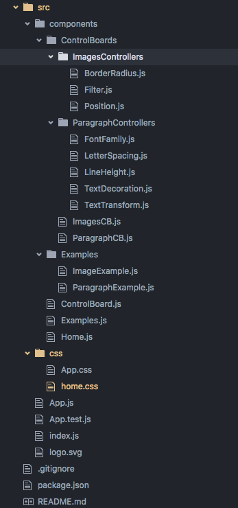
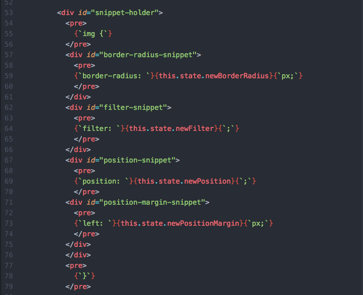
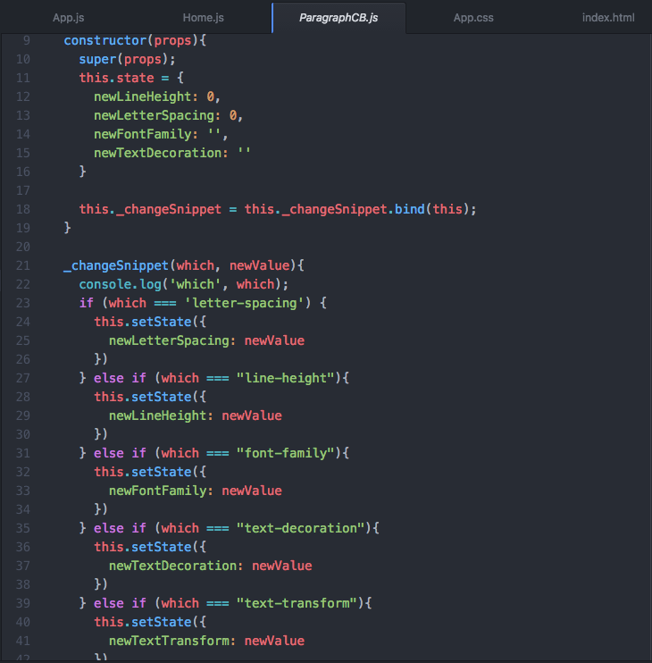
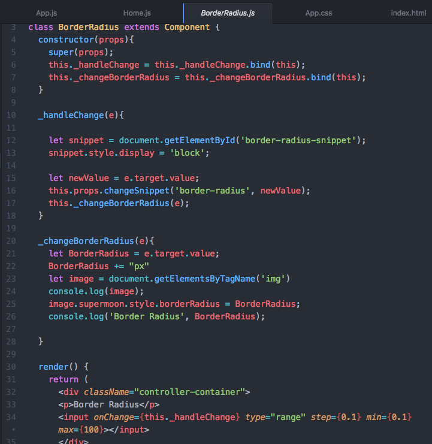
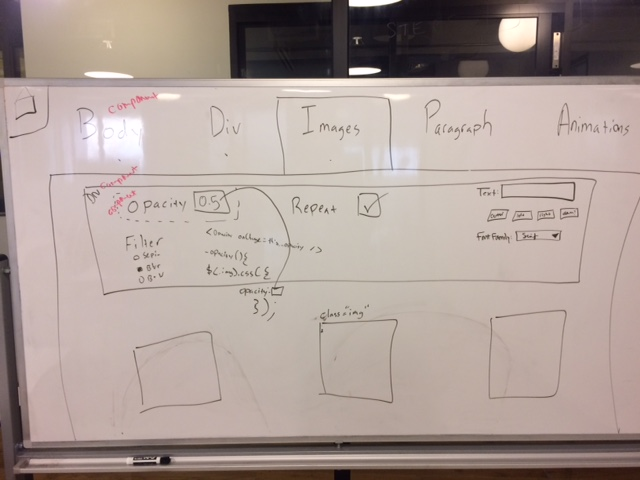
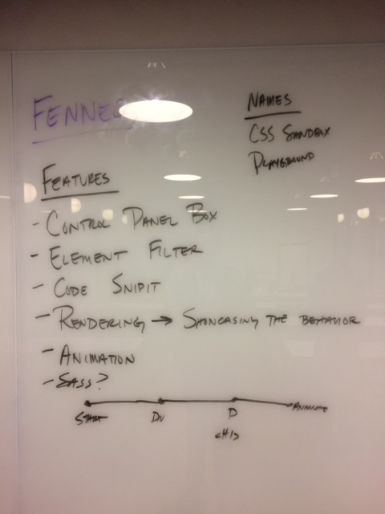

# Sandbox
#### An educational tool that provides a real-time visual representation for the behavior of css properties.

## Synopsis
Sandbox is structured to render a component for the example box and control board depending which of the typography elements is selected.  The control board then renders its corresponding properties while the example box also displays either an image or text.  We separated out the control board elements to make them easily accessible if we are to add additional elements to the site.

## Motivation

We developed this app from a personal need for more practice with React and a better understanding of css properties. While there are some applications online that illustrate specific properties, like buttons or typography, there isn't an application that showcases all the css features available and let's the user test them out and even see how it's written in code.

## Code

The application takes advantage of React's component structure. The entire page lives in the main App.js broken into two main components; the control board and the example. Note, that the code snippet is housed within the control board.

 Both of these components essentially are an empty frame that pulls in the board with the appropriate controller components depending on which page is clicked.

 

 

##UX Design
We tried to adhere to our style guide and feedback from the UX team as much as possible. The design has changed considerably from what we originally had

##Stretch Goals
There are a lot of ways to continue building this project. For one, we started with a small mvp of just one component and three controllers. While we were able to get two features up, we would like to finish adding all of them in. Another stretch goal is adding more CSS to the page itself to further illustrate the power of css in front-end design. Third, we could refactor some of our code like the code snippet being its own separate component.

## Contributors

######*coded by Aaron, Bryony, Clint from WDI8*

######*designed by Tyler, Evan, Matt from UXDI5*

## License

######*funded by the silicon valley association for most React-based 2016 javascript webapps of america association*
